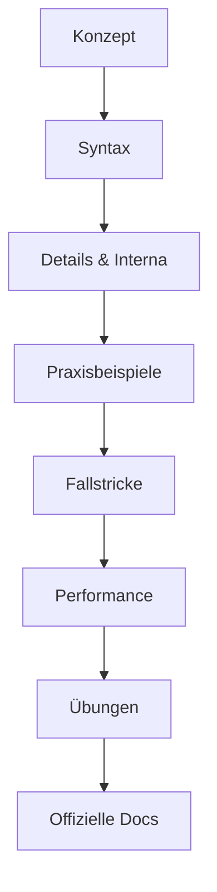

[[INDEX|📑 Index]] | [[00_Start/Wie dieses Buch nutzen|Weiter →]]

# 📖 Willkommen zum Python Datenstrukturen Handbuch

> [!quote] "Talk is cheap. Show me the code." - Linus Torvalds

Herzlich willkommen zu deiner umfassenden Reise durch die Welt der Python Datenstrukturen! 

## 🎯 Für wen ist dieses Buch?

Dieses Buch ist speziell für dich gemacht, wenn du:

✅ **Erfahrener Entwickler** bist, aber Python neu für dich ist  
✅ **Detailversessen** bist und genau wissen willst, wie die Dinge funktionieren  
✅ **Praxisorientiert** lernen möchtest mit vielen Code-Beispielen  
✅ **Tiefes Verständnis** über Datenstrukturen aufbauen willst  
✅ **Performance und Interna** verstehen möchtest  

❌ **Nicht geeignet** als absolute Programmier-Einführung

## 🚀 Was dich erwartet

### 📚 Umfassende Abdeckung

Dieses Buch deckt **alle** Python Datenstrukturen ab Version 3.12+ ab:

- **Einfache Typen**: int, float, str, bool, None, bytes
- **Sequenzen**: list, tuple, range, und ihre Operationen
- **Mappings**: dict und verwandte Strukturen
- **Sets**: set, frozenset und Mengenoperationen
- **Fortgeschrittene**: array, deque, heapq, dataclasses, enums
- **Modern**: Pattern Matching (3.10+), Type Hints

### 🎓 Didaktischer Aufbau

Jedes Kapitel folgt einer bewährten Lernstruktur:



### 💻 Praxis, Praxis, Praxis

- **Lauffähiger Code**: Alle Beispiele sind vollständig und getestet
- **Output-Beispiele**: Du siehst, was rauskommen soll
- **Übungen**: 3-5 Aufgaben pro Thema mit Lösungen
- **Projekte**: Reale Anwendungsfälle zum Üben

### 🔍 Detailtiefe

Besonders **komplexe Strukturen** wie Listen, Dictionaries und Sets werden intensiv behandelt:

- Alle Methoden einzeln erklärt
- Memory-Layout und interne Implementierung
- Performance-Charakteristiken (Big-O Notation)
- Best Practices und typische Patterns
- Vergleiche zwischen verschiedenen Strukturen

## 📖 Wie ist das Buch strukturiert?

Das Buch ist in **6 Hauptteile** mit insgesamt **~90 Seiten** gegliedert:

### Teil 1️⃣: Grundlagen & Einfache Datentypen
Der fundamentale Start: Typ-System, Zahlen, Strings, Bytes  
**→ 15 Seiten**

### Teil 2️⃣: Sequenzielle Datenstrukturen
Listen, Tupel, Slicing, Comprehensions  
**→ 20 Seiten** (besonders detailliert!)

### Teil 3️⃣: Mappings und Sets
Dictionaries, Sets und das Collections-Modul  
**→ 18 Seiten** (sehr detailliert!)

### Teil 4️⃣: Fortgeschrittene Strukturen
Arrays, Deque, Heaps, Dataclasses, Enums  
**→ 15 Seiten**

### Teil 5️⃣: Pattern Matching & Type Hints
Moderne Python-Features ab Version 3.10  
**→ 10 Seiten**

### Teil 6️⃣: Praxis & Performance
Best Practices, Optimierung, reale Projekte  
**→ 12 Seiten**

## 🎨 Was macht dieses Buch besonders?

### 1. Deutsche Sprache
Alle Erklärungen auf Deutsch, aber mit englischen Code-Beispielen (wie in der Praxis üblich).

### 2. Offizielle Dokumentation
Jede Seite verlinkt die **offizielle Python-Dokumentation** mit genauer Beschreibung, was du dort findest.

### 3. Python 3.12+ Features
Fokus auf moderne Python-Features:
- PEP 701: f-string Improvements
- PEP 698: Override Decorator  
- Improved Error Messages
- Performance Improvements

### 4. Memory & Performance
Du lernst nicht nur das "Was", sondern auch das "Wie" und "Warum":
- Wie sind Datenstrukturen intern aufgebaut?
- Welche Performance-Charakteristiken haben sie?
- Wann sollte ich welche Struktur verwenden?

### 5. Von Entwickler zu Entwickler
Da du bereits Erfahrung hast, überspringe ich Basics wie "Was ist eine Variable?" und fokussiere auf:
- Python-spezifische Konzepte
- Unterschiede zu anderen Sprachen
- Idiomatisches Python ("Pythonic Code")
- Professionelle Best Practices

## 🛠️ Technische Voraussetzungen

### Software
- **Python 3.12** oder neuer
- Ein Code-Editor (VS Code, PyCharm, o.ä.)
- Terminal/Kommandozeile

### Installation überprüfen
```python
import sys
print(f"Python {sys.version}")

# Sollte ausgeben: Python 3.12.x oder höher
```

### Empfohlene Tools
- **IPython** oder **Jupyter**: Für interaktives Experimentieren
- **pytest**: Für Übungen mit Tests
- **mypy**: Für Type Checking (ab Teil 5)

## 📝 Wie du dieses Buch nutzen solltest

### Für Anfänger in Python

1. **Linear durcharbeiten**: Beginne bei Teil 1 und arbeite dich durch
2. **Jeden Code ausprobieren**: Tippe die Beispiele ab (nicht kopieren!)
3. **Alle Übungen machen**: Praxis ist entscheidend
4. **Links folgen**: Verwandte Themen vertiefen das Verständnis

### Für Fortgeschrittene

1. **Gezielt nachschlagen**: Nutze den Index für spezifische Themen
2. **Performance-Kapitel**: Studiere die O-Notation-Analysen
3. **Projekte**: Springe direkt zu Teil 6 für reale Anwendungen
4. **Interna**: Fokussiere auf die "Details & Interna"-Abschnitte

### Als Nachschlagewerk

1. **Obsidian-Suche**: Nutze die Volltextsuche
2. **Graph View**: Visualisiere Zusammenhänge zwischen Themen
3. **Glossar**: Schneller Zugriff auf Definitionen
4. **Bookmarks**: Markiere wichtige Seiten

## 💡 Lernstrategie

### Effektives Lernen

> [!tip] Aktives Lernen
> - Schreibe Code selbst, nicht nur lesen!
> - Experimentiere mit Variationen
> - Versuche Konzepte zu erklären (Feynman-Technik)
> - Nutze die Python REPL für schnelle Tests

### Typischer Lernzyklus

1. **Lesen**: Verstehe das Konzept
2. **Coden**: Tippe die Beispiele ab
3. **Variieren**: Ändere Parameter, teste Grenzen
4. **Üben**: Mache die Übungsaufgaben
5. **Anwenden**: Nutze es in eigenen Mini-Projekten
6. **Wiederholen**: Komm nach 1-2 Tagen zurück

### Zeit-Investment

- **Grundlagen** (Teil 1): 5-7 Stunden
- **Sequenzen** (Teil 2): 8-10 Stunden
- **Mappings** (Teil 3): 7-9 Stunden
- **Fortgeschritten** (Teil 4): 6-8 Stunden
- **Pattern Matching** (Teil 5): 4-5 Stunden
- **Praxis** (Teil 6): 10-15 Stunden

**Gesamt: ca. 40-54 Stunden** intensives Lernen

## 🎯 Lernziele

Nach Abschluss dieses Buches wirst du:

✅ Alle Python Datenstrukturen **beherrschen**  
✅ **Idiomatischen** Python-Code schreiben  
✅ Die **richtige Datenstruktur** für jedes Problem wählen  
✅ **Performance-Implikationen** verstehen  
✅ **Memory-Effizienz** optimieren können  
✅ **Moderne Python-Features** (3.12+) nutzen  
✅ **Professionellen** Python-Code schreiben  

## 🤝 Feedback & Verbesserungen

Dieses Buch lebt von Feedback:

- **Fehler gefunden?** → Notiere sie für Korrekturen
- **Unklare Erklärungen?** → Markiere sie zur Überarbeitung
- **Zusätzliche Beispiele gewünscht?** → Ergänze eigene
- **Weitere Übungen?** → Erstelle eigene Challenges

## 📚 Zusätzliche Ressourcen

Dieses Buch ist umfassend, aber Python ist riesig. Weitere Themen:

- **OOP**: Klassen, Vererbung, Magic Methods
- **Funktionale Programmierung**: map, filter, reduce, itertools
- **Concurrency**: Threading, Asyncio, Multiprocessing
- **Testing**: unittest, pytest, mocking
- **Packages**: Erstellen und Verteilen von Packages

→ Diese Themen sind **nicht** Teil dieses Buches, aber wichtig für professionelle Python-Entwicklung.

## 🚀 Bereit?

Lass uns loslegen! Der beste Weg, Python zu lernen, ist es zu **benutzen**.

> [!success] Next Steps
> 1. Lies [[00_Start/Wie dieses Buch nutzen|Wie dieses Buch nutzen]]
> 2. Überprüfe deine Python-Installation
> 3. Starte mit [[01_Grundlagen/01_Einführung/01_Python Typ-System|Python Typ-System]]

**Viel Erfolg auf deiner Python-Reise! 🐍**

---

[[INDEX|📑 Index]] | [[00_Start/Wie dieses Buch nutzen|Weiter →]]